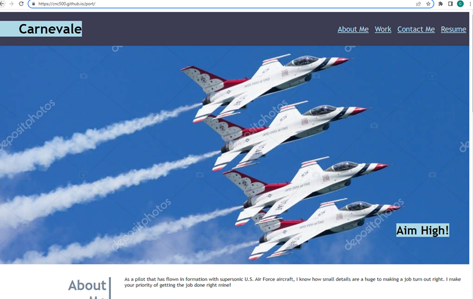
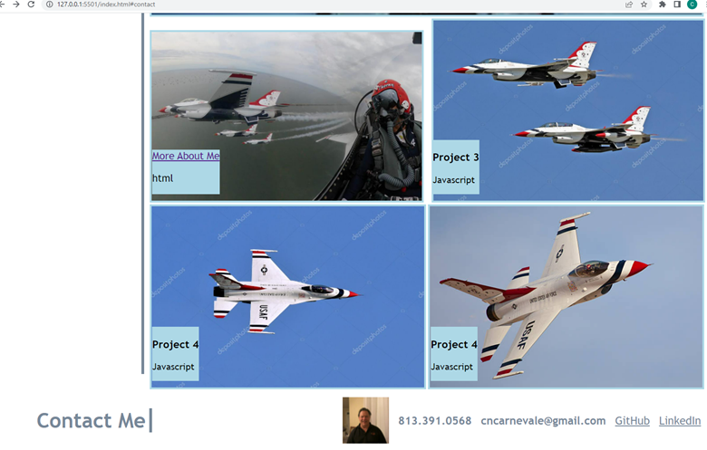

# Portfolio

The purpose of this assignment is to my personal portfolio to showcase my work and to provide my my potential employers information about me.

## Accomplishments

You can click on my work to date and a link takes you to the repositories where my work resides.  Note that there are only two projects so far, and Projects 3 and 4 serve as placeholders for future projects, 

Flexbox was used extensively, and the Weather Dashboard is a homework with a project link that is tied to the large image above the four smaller ones.  This portfolio will be replaced soon with one completed using react.js.  

Alternatives have been provided in case images fail to load.

## Deployment

The deployment of the webpage was successful and is at https://cnc500.github.io/Port/

## Screenshots 

## References

depositphotos.com
U.S. Department of Defense
stripes.com
istockphoto.com
